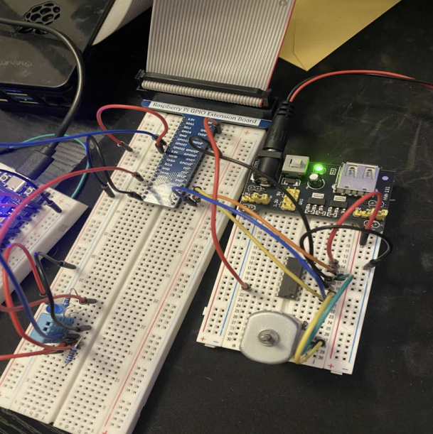

**SmartHome IoT** is a comprehensive platform designed to seamlessly integrate and manage a Raspberry Pi and ESP32 within a residential environment. By connecting smart appliances, sensors, lighting, security systems, and environmental controls, it enables homeowners to automate daily routines, optimize energy consumption, and enhance overall safety. The system provides real-time monitoring and remote access through intuitive interfaces, allowing users to control their homes from anywhere at any time.

The application is built using **C++** for backend logic and **SQLite** database interactions, while **React** powers the interactive front-end components, enabling smooth and responsive user experiences.

## 🧩 Features

**Real-time** updates via the dashboard

**Light Intensity** detection and control

**Temperature & Humidity** reading and control

**Email notification** system for alerts and updates

## 🔒 Security

**RFID Access**: User login using RFID Tags for customizable settings based on the users profile

## 💡Technologies used

- **C++**
- **React**
- **JavaScript**
- **CSS**
- **Raspberry Pi**
- **ESP32**

## 🌐 Github Link

[SmartHome IoT](https://github.com/Trevor-Km/smarthome-iot)

## ⚙️ Hardware

## 🎯 Objective

To deliver a user-friendly and centralized smart home management system that allows users to monitor, control, and automate household devices and environments in real-time, enhancing convenience, energy efficiency, and home security through seamless integration and intuitive interfaces.

🚀 *Developed by Trevor-Km.*
